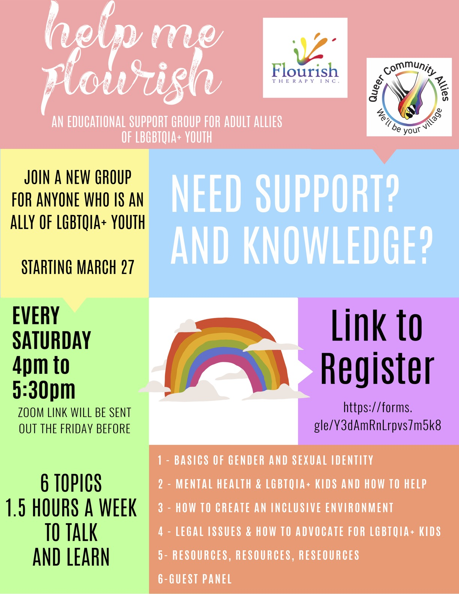

---
title: Welcome
--- 

Coming up in March! 

Help Me Flourish is a new, free, educational support group for adult allies of lgbtqia+ youth! Register [HERE](https://docs.google.com/forms/d/e/1FAIpQLSem6-yuoExuTiQo0WEKfHdZItBnRhj_odWUhD0gFuNr10lvTQ/viewform) or click the flyer image above! 

Starting March 27, every Saturday 4pm to 5:30 for 6 weeks. (Zoom link will be sent out to those registered the Friday before.)

- basics of gender and sexual identity
- mental health and lgbtqia+ kids and how to help
- how to create an inclusive environment
- legal issues and how to advocate for lgbtqia+ kids
- resources, resources, resources
- guest panel 

By Flourish Therapy Inc. and Queer Community Allies
 
## Stay connected! 

#SafeHands #CoronaKindness #SchoolSafety #COVID19  
We love this list from Youth Assisting Youth with [10 virtual activity ideas](https://youthassistingyouth.com/10-virtual-activities-kids-mentors-covid-19/)! 

- TrevorText, confidential text message with a Trevor counselor, text START to 678678. 
- [SafeUT](https://safeut.med.utah.edu)  
- [Gender Spectrum has online groups](https://www.genderspectrum.org/articles/gender-spectrum-groups)! Teens (ages 13-19), Black Trans and Non-Binary Teen Group, Pre-Teens (ages 10-12), National Parent Support Group, and [so many more](https://www.genderspectrum.org/articles/blog-covid-resources). 
- [GLBT National Youth Talkline](https://www.glbtonline.org) provides telephone, online, and private one-to-one chat and email peer support. This includes weekly youth chat rooms and IM with a peer support volunteer. 
- [Utah Pride Center Youth online support groups](https://utahpridecenter.org/programs/youth-family-programs/) for ages 10-14 and 14-20. Email youth(at)utahpridecenter(dot)org for more.  
- [QChat Space](https://www.lgbtcenters.org/Q-Chat-Space), live, chat-based, professionally facilitated, online support and discussion groups for LGBTQ+ teens 13-19
- [Encircle](https://encircletogether.org) is doing online group meets!  
- Other help? Domestic Abuse? Housing? Legal? Food? One place to start is [Utah211](https://211utah.org). 

If you or someone you know is in crisis call the National Suicide Prevention Lifeline at 1-800-273-8255 or text CONNECT to 741741 for the National Crisis Text Line. More at [Utah Pride Center Suicide Prevention](https://utahpridecenter.org/prevention). 

## 10 Ways to Be an Ally & a Friend (from GLAAD)  

- Be a listener.
- Be open-minded.
- Be willing to talk.
- Be inclusive.
- Don't assume that your friends and co-workers are straight. Someone close to you could be looking for support in their coming-out process. 
- Anti-LGBT comments and jokes are harmful. Vocalize that you find them offensive.
- Confront your own prejudices and bias, even if it is uncomfortable to do so.
- Defend your LGBT friends against discrimination.
- Believe that all people, regardless of gender identity and sexual orientation, should be treated with dignity and respect.

## A big thank you to local businesses that have supported Queer Community Allies & GSAs! 

- American Name Services (2019)
- Backyard Bookkeeper (2019)
- Beans & Brews (2019)
- Coffee Creations (2019)
- Cravings Alisha's Cupcakes (2020)
- Grinders Coffee House (2020) 
- J Dawgs (2020)
- MOD Pizza Saratoga Springs (2020)
- Mojo Printing (2020)
- Revolution Print & Packaging (2020) 
- Shirtbatter (2019)
- YogaVega (2019) 

 

Logo design by Larissa Norman
