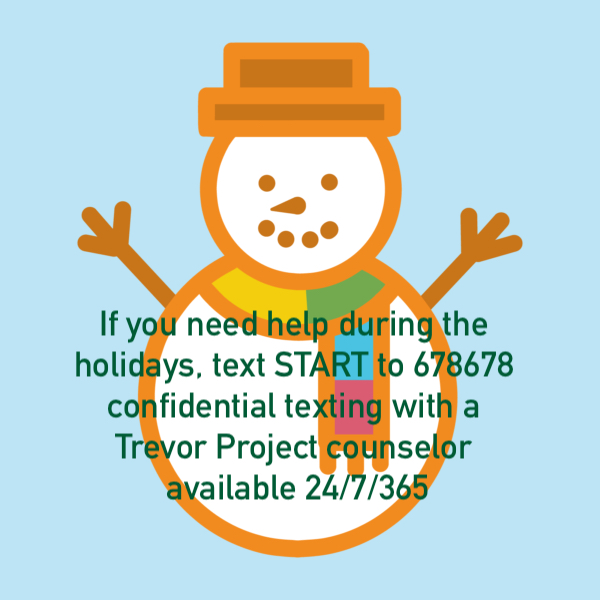

 
## What's Happening in January  

- For our teen artists, 11th & 12th graders, check out the [48th Annual Utah All-State High School Art Show at the Springville Museum of Art!](http://www.smofa.org/48th-high-school-art-show.php?fbclid=IwAR2dvRZwKAssmxs2dy1iTCgUC68VnJ3xFrk-sLDcx8uWzxbWj2_wAYlJ6Cs) The show runs February 9, 2020-March 22, 2020. Online entry form available Friday, January 3, 2020.

Utah County Support Groups & Organizations

~Rainbow Mutual, events for teens, held throughout Utah and Salt Lake counties

~Mama Dragons, support group for moms with LGBTQIA+ youth

~Dragon Dads, support group for dads with LGBTQIA+ youth

~Gender Bands (Provo), funding for trans surgeries and weekly meetups for trans teens and adults

~Queer Meals (Provo), family meals in a safe space for queer teens and young adults

~Encircle (Provo), center and therapy with events for LGBTQ teens and families

~Project Rainbow, flags for special LGBT days of the year

~GLSEN Northern Utah, supports inclusive education and schools

