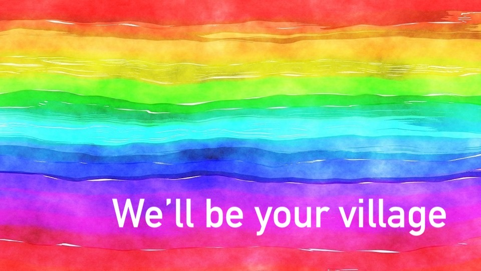

 
## What's Happening in November 

- Queer Community Allies has been reaching out to local businesses asking for gift cards and monetary donations! All donated gift cards will be bundled as a prize for our holiday drawing. If we receive enough donations, we will do multiple prize bundles! From Monday Nov. 18 to Sun. Dec. 29, 2019, all individuals who donate $10 to Queer Community Allies will be entered into a holiday drawing; individuals may be entered as many times as they wish. ($100 = 10 entries!) The drawing will be on December 30. All monetary donations from local businesses and from our holiday drawing will be put towards helping GSAs for the rest of the school year, funding ongoing projects, and planning summer community events! *Queer Community Allies is volunteer-led; and board members and volunteers involved in the organization will be ineligible for the prize(s). 

- We support Project Rainbow! Check out the wonderful work they're doing for Transgender Day of Remembrance. [https://www.projectrainbowutah.org](https://www.projectrainbowutah.org)

- Educator Pins ~ 
Advisors and teachers love having pins in their classroom that they can give to those in the high school who want to display their ally support. We purchase batches of pins to donate, as we receive requests from safe allies on behalf of their spaces. Every $2.50 that you donate (check out our Donate page) gets a pin to a teacher at a high school or other safe space. 🏳️‍🌈 

